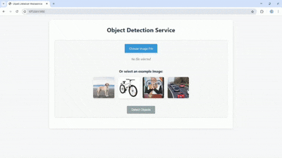
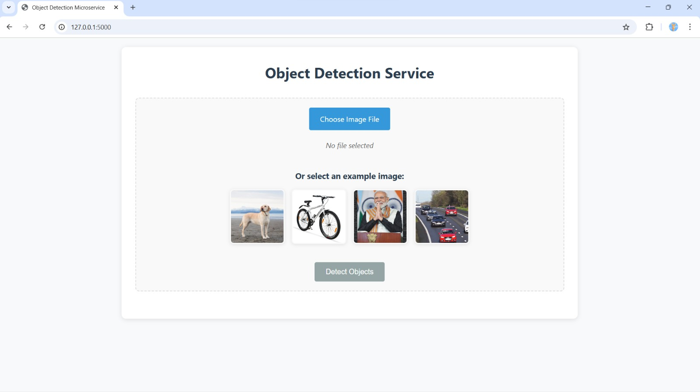
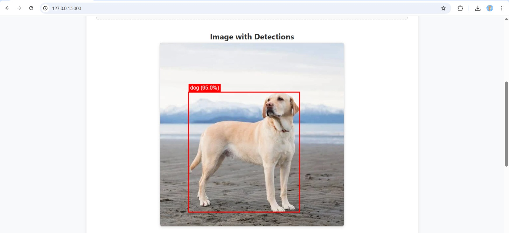
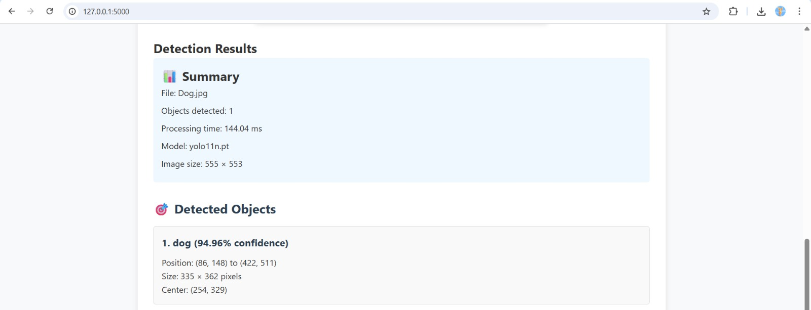
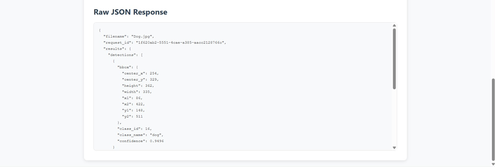

# AiMonk - Object Detection Microservice
A production-ready microservice for object detection using YOLOv11, with a clean web interface and scalable architecture.

## Architecture
The system consists of two main services:
1. **UI Backend** (Port 5000): Handles user interface, file uploads, and communicates with the AI backend
2. **AI Backend** (Port 5001): Handles YOLOv11 model loading and object detection

```
┌─────────────────┐    ┌─────────────────┐
│   UI Backend    │    │   AI Backend    │
│   (Port 5000)   │◄──►│   (Port 5001)   │
│                 │    │                 │
│ • Web Interface │    │ • YOLOv11 Model │
│ • File Upload   │    │ • Object        │
│ • User Input    │    │   Detection     │
│ • Results       │    │ • JSON Output   │
│   Display       │    │                 │
└─────────────────┘    └─────────────────┘
```

## Features
- Web-based interface for image uploads
- Real-time object detection using YOLOv11 Nano
- Structured JSON responses with detection results
- Robust error handling and validation
- Docker containerization for easy deployment
- Health check endpoints for monitoring
- Rate limiting to prevent abuse
- Example images for quick testing
- Bounding box visualization on uploaded images
- Responsive design for mobile and desktop

## Quick Start
### Prerequisites
- Docker and Docker Compose installed
- At least 4GB of RAM available
- Network access to download Docker images and YOLO model

### Getting the Code
Clone the repository:
```bash
git clone https://github.com/hariharan1412/AiMonk.git
cd AiMonk
```

### Running the Application
Start the services using Docker Compose:
```bash
docker-compose up --build
```

Once the services are running:
1. Open your browser and navigate to `http://localhost:5000`
2. Upload an image or select one of the example images
3. Click "Detect Objects" to process the image
4. View the results with bounding boxes overlaid on the image

### Testing with cURL
```bash
# Upload an image for detection
curl -X POST -F "image=@test_images/sample.jpg" http://localhost:5000/upload

# Check service health
curl http://localhost:5000/health
```

## Project Structure
```
AiMonk/
├── ai-backend/                 # AI backend service
│   ├── app.py                  # Flask application for AI backend
│   ├── detector.py             # YOLOv11 detector implementation
│   ├── utils.py                # Utility functions
│   ├── requirements.txt        # Python dependencies
│   ├── Dockerfile              # Docker configuration
│   └── .env                    # Environment variables
├── ui-backend/                 # UI backend service
│   ├── app.py                  # Flask application for UI backend
│   ├── templates/              # HTML templates
│   │   ├── index.html          # Main upload interface
│   │   └── result.html         # Results display page
│   ├── static/                 # Static assets
│   │   ├── style.css           # Stylesheet
│   │   ├── script.js           # JavaScript functionality
│   │   └── example_images/     # Sample images for testing
│   ├── requirements.txt        # Python dependencies
│   ├── Dockerfile              # Docker configuration
│   └── .env                    # Environment variables
├── outputs/                    # Output directory (created at runtime)
├── docker-compose.yml          # Docker Compose configuration
├── run.sh                      # Start script
├── README.md                   # This file
└── tools.py                    # Helper scripts
```

## Test Images
This project includes sample test images in `ui-backend/static/example_images/`:
- **dog.png**: Single dog for animal detection testing
- **cycle.png**: Bicycle for vehicle detection testing  
- **person.jpg**: Person for human detection testing
- **car.jpg**: Car for automotive detection testing

These images allow immediate testing without needing to upload custom images.

## Screenshots and Demo
Below are screenshots of the AiMonk application in action, along with a demo GIF showing the complete workflow.

### Demo GIF


### Screenshots

1. **Main Interface**: The upload interface with example images
   

2. **Image Detection**: Image Detectionwith bounding boxes overlaid on the image
   

3. **Detection summary**: Results with Summary and Detected Objects
   

4. **JSON Output**: The structured JSON response
   

## API Documentation
### UI Backend Endpoints
#### `GET /`
Returns the main HTML interface for uploading images.

#### `POST /upload`
Accepts an image file for object detection.

**Request:**
- Content-Type: `multipart/form-data`
- Body: Form data with `image` field containing the image file

**Response:**
```json
{
  "success": true,
  "request_id": "uuid-string",
  "filename": "uploaded-image.jpg",
  "results": {
    "detections": [
      {
        "class_id": 0,
        "class_name": "person",
        "confidence": 0.95,
        "bbox": {
          "x1": 100,
          "y1": 200,
          "x2": 300,
          "y2": 500,
          "width": 200,
          "height": 300,
          "center_x": 200,
          "center_y": 350
        }
      }
    ],
    "total_objects": 1,
    "processing_time_ms": 150.25,
    "model_info": {
      "model_name": "yolo11n.pt",
      "total_classes": 80,
      "confidence_threshold": 0.25
    },
    "image_info": {
      "width": 1920,
      "height": 1080,
      "channels": 3
    }
  }
}
```

#### `GET /health`
Health check endpoint that also checks the AI backend status.

### AI Backend Endpoints
#### `POST /detect`
Performs object detection on the provided image.

#### `GET /health`
Health check endpoint with model status.

#### `GET /model/info`
Returns detailed model information.

## Output Format
The service returns detection results in a structured JSON format:
```json
{
  "success": true,
  "request_id": "uuid-string",
  "detections": [
    {
      "class_id": 0,
      "class_name": "person",
      "confidence": 0.95,
      "bbox": {
        "x1": 100,        // Top-left X coordinate
        "y1": 200,        // Top-left Y coordinate
        "x2": 300,        // Bottom-right X coordinate
        "y2": 500,        // Bottom-right Y coordinate
        "width": 200,      // Width of bounding box
        "height": 300,     // Height of bounding box
        "center_x": 200,   // Center X coordinate
        "center_y": 350    // Center Y coordinate
      }
    }
  ],
  "total_objects": 1,
  "processing_time_ms": 150.25,
  "model_info": {
    "model_name": "yolo11n.pt",
    "total_classes": 80,
    "confidence_threshold": 0.25
  },
  "image_info": {
    "width": 1920,
    "height": 1080,
    "channels": 3
  }
}
```

## Deployment
### Docker Deployment (Recommended)
Start services in detached mode:
```bash
docker-compose up -d --build
```

View logs:
```bash
docker-compose logs -f
```

Stop services:
```bash
docker-compose down
```

### Production Considerations
**For production deployment, consider these Docker-specific optimizations:**

1. **Model Cache Management**: Mount model cache to host directory to avoid large image layers and faster startups
```yaml
volumes:
  - ./model-cache:/root/.cache/ultralytics  # Avoids re-downloading model
```

2. **Resource Allocation**: Ensure sufficient memory allocation in docker-compose.yml
```yaml
ai-backend:
  deploy:
    resources:
      limits:
        memory: 2G
      reservations:
        memory: 1G
```

3. **Persistent Storage**: Use bind mounts for important directories
```yaml
volumes:
  - ./outputs:/app/outputs        # Save detection results
  - ./logs:/app/logs              # Persist application logs
```

4. **Environment Configuration**: Use environment variables for different deployment stages
```bash
# Production
docker-compose -f docker-compose.prod.yml up -d
# Staging  
docker-compose -f docker-compose.staging.yml up -d
```

5. **Security**: 
   - Use HTTPS reverse proxy (nginx)
   - Implement authentication if needed
   - Configure proper firewall rules
   - Run containers as non-root users

## Troubleshooting
### Common Issues
1. **Service fails to start**
   - Check if ports 5000 and 5001 are available
   - Verify Docker is running and you have sufficient permissions
   - Check logs with `docker-compose logs`

2. **Model loading fails**
   - Ensure internet connectivity for model download
   - Check if there's enough disk space for the model
   - Verify model URL in environment variables

3. **Detection fails**
   - Check image format and size (max 16MB)
   - Verify the image is not corrupted
   - Check AI backend logs for error messages

4. **UI cannot connect to AI backend**
   - Verify both services are running
   - Check network configuration in Docker Compose
   - Verify AI_BACKEND_URL environment variable

### Getting Logs
```bash
# View all logs
docker-compose logs

# View logs for a specific service
docker-compose logs ai-backend
docker-compose logs ui-backend

# Follow logs in real-time
docker-compose logs -f
```

## Deliverables
This technical assessment includes:
- Complete project codebase with Docker containerization
- Comprehensive documentation (this README.md)
- Output images with bounding boxes (generated in outputs/ directory)
- Corresponding JSON files with detection results
- Screenshots of the application (4 images)
- Demo GIF showing the complete workflow

## Conclusion
AiMonk demonstrates a production-ready approach to object detection using containerized microservices. The architecture provides scalability, maintainability, and a clean separation between the UI and AI components.

## References
This project utilizes several open-source technologies:
- [YOLOv11](https://github.com/ultralytics/ultralytics) - Object detection model
- [Flask](https://flask.palletsprojects.com/) - Web framework
- [OpenCV](https://opencv.org/) - Computer vision library
- [Docker](https://www.docker.com/) - Containerization platform
